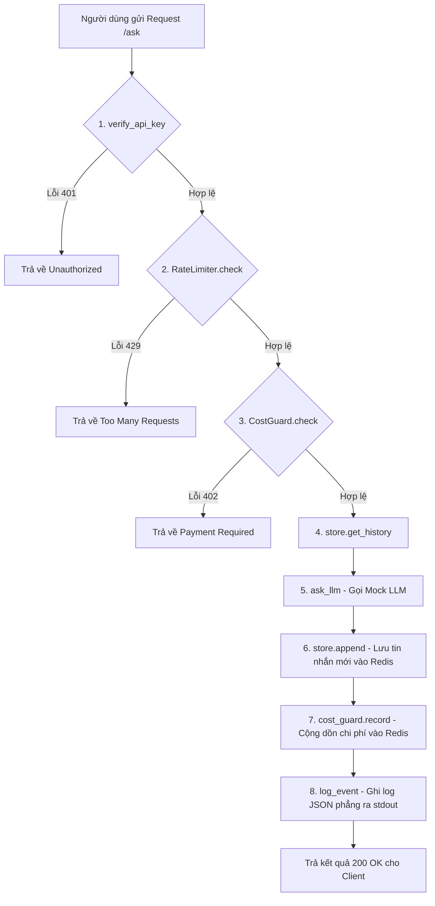
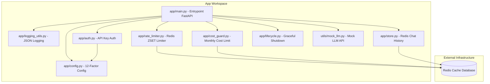

# Giải thích Dự án: Hạ tầng Cloud & Deployment cho AI Agent

Tài liệu này giải thích chi tiết về cấu trúc, cách vận hành, và các quyết định thiết kế của dự án **K3-Day12-And-Deployment** nhằm giúp Sếp nhanh chóng nắm bắt kiến thức cốt lõi.

---

## 1. Tóm tắt yêu cầu cốt lõi
Mục tiêu tối thượng của dự án là đưa một AI Agent từ chạy cục bộ (localhost) lên môi trường hạ tầng Cloud thực tế hoạt động công khai. Ứng dụng phải đảm bảo các tiêu chí chất lượng chạy thực tế (Production-ready):
1. **Bảo mật**: Xác thực API Key an toàn và chống Timing Attack.
2. **Khả năng kiểm soát chi phí**: Rate limit theo giây và chặn chi tiêu LLM theo tháng.
3. **Độ tin cậy & Sẵn sàng**: Ứng dụng Stateless (không giữ trạng thái trong RAM để scale ngang được) và tắt/bật ứng dụng êm đẹp (Graceful Shutdown/Probes) không làm đứt request của người dùng.
4. **Tối ưu hóa hạ tầng**: Đóng gói Docker dạng Multi-stage siêu nhẹ và chạy bằng user thường bảo mật.

---

## 2. Những việc ĐƯỢC LÀM & KHÔNG ĐƯỢC LÀM

### Được làm:
* Tách biệt cấu hình khỏi mã nguồn bằng biến môi trường (12-Factor Config).
* Sử dụng Redis làm cơ sở dữ liệu lưu trữ lịch sử chat tập trung (Stateless) và đếm rate limit.
* Cấu hình Dockerfile multi-stage để giảm dung lượng file build xuống dưới 500MB.
* Viết log có cấu trúc dạng JSON phẳng 1 dòng ghi trực tiếp ra console (`stdout`).
* Triển khai endpoint `/health` và `/ready` phục vụ giám sát container.

### Không được làm:
* **Tuyệt đối không hardcode** (viết cứng) API Key hay mật khẩu trong code.
* **Không gán giá trị mặc định** cho các biến môi trường nhạy cảm như `AGENT_API_KEY`.
* **Không kết nối Redis hoặc Database** bên trong endpoint `/health` (Liveness Probe).
* **Không dùng toán tử so sánh thông thường `==`** để so khớp API Key nhằm tránh lỗi Timing Attack.
* **Không tạo file `.html`** chứa sơ đồ trong workspace (chỉ viết sơ đồ Mermaid trực tiếp trong file `.md`).

---

## 3. Cơ chế hoạt động (HOW — Nó chạy như thế nào?)

### 3.1. Luồng xử lý một Request `/ask` (Sơ đồ Pipeline)
Dữ liệu từ người dùng gửi tới sẽ được xử lý qua 8 bước tuần tự như sau:

### 3.2. Cấu trúc và liên kết các file (Sơ đồ File Layout)
Dưới đây là sơ đồ phân bổ các thư mục, file và mối quan hệ import/kết nối giữa các module trong ứng dụng:

---

## 4. Công nghệ nền tảng (WHAT — Nhờ gì mà hoạt động?)

1. **FastAPI**: Framework web Python hiện đại, hiệu năng cao, dùng để xây dựng các API endpoint (`/ask`, `/health`, `/ready`).
2. **Pydantic Settings**: Thư viện dùng để đọc cấu hình ứng dụng từ file `.env` hoặc biến môi trường hệ thống, tự động ép kiểu và xác thực dữ liệu lúc startup.
3. **Redis**: Database dạng key-value chạy trên RAM siêu nhanh. Được dùng để:
   * Lưu lịch sử chat (Redis List).
   * Lưu dữ liệu rate limit cửa sổ trượt (Redis Sorted Set - ZSET).
   * Lưu tổng chi tiêu của user theo tháng (Redis String).
4. **python-docx**: Thư viện dùng để tạo file Word bài giảng trong quá trình học tập.
5. **Docker**: Đóng gói toàn bộ code và thư viện của ứng dụng vào một "container" để đảm bảo ứng dụng chạy giống hệt nhau trên máy local và trên cloud.

---

## 5. Các cách làm thay thế (ALTERNATIVES — Có mấy cách?)

### Cách 1: Sử dụng In-memory Storage (Lưu dữ liệu trong RAM của App)
* **Mô tả**: Lưu lịch sử chat, số lượng request và chi phí trong các biến toàn cục (Global Dict) của Python.
* **Ưu điểm**: Đơn giản nhất, không cần cài đặt hay kết nối tới Redis, tốc độ truy xuất cực kỳ nhanh.
* **Nhược điểm**: 
  * Khi scale ứng dụng lên nhiều container, dữ liệu sẽ bị chia rẽ (Container A không đọc được lịch sử chat của Container B).
  * Mỗi lần cập nhật code hoặc restart container, toàn bộ lịch sử và số liệu chi phí của khách hàng sẽ bị xóa sạch.

### Cách 2: Sử dụng Database truyền thống (SQL như PostgreSQL hoặc NoSQL như MongoDB)
* **Mô tả**: Lưu lịch sử chat và chi phí vào các bảng cơ sở dữ liệu lưu trên ổ đĩa.
* **Ưu điểm**: Dữ liệu được lưu trữ bền vững lâu dài, dễ dàng thực hiện các câu lệnh truy vấn phức tạp hoặc làm báo cáo tài chính.
* **Nhược điểm**: Tốc độ đọc/ghi chậm hơn Redis rất nhiều (do phải ghi xuống ổ đĩa). Đối với tác vụ đọc/ghi lịch sử liên tục mỗi request và đếm rate limit theo từng giây, SQL DB dễ bị nghẽn cổ chai (bottleneck).

### Cách 3: Sử dụng API Gateway độc lập (như Kong hoặc APISix)
* **Mô tả**: Tách phần xác thực (Auth) và giới hạn request (Rate Limiting) ra một lớp hạ tầng nằm trước ứng dụng FastAPI.
* **Ưu điểm**: Giúp code ứng dụng FastAPI nhẹ nhàng hơn, chỉ tập trung vào logic AI; lớp Gateway được tối ưu hóa bằng C/Go nên xử lý chặn spam cực kỳ mạnh mẽ.
* **Nhược điểm**: Phức tạp hóa kiến trúc hệ thống, khó cấu hình cho các dự án nhỏ và khó tích hợp tính năng Cost Guard (vốn liên quan trực tiếp đến số lượng token phản hồi từ LLM bên trong code ứng dụng).

---

## 6. Tại sao chọn cách này? (WHY — Trade-off đã chấp nhận)

Dự án lựa chọn kết hợp **FastAPI + Redis**:
* **Lý do**: Đây là kiến trúc chuẩn công nghiệp cho các ứng dụng Real-time/AI Agent nhờ tốc độ phản hồi cực nhanh của Redis (truy xuất RAM) đáp ứng tốt bài toán rate limit theo giây và truy xuất lịch sử chat liên tục.
* **Trade-off (Sự đánh đổi)**: Chấp nhận tăng thêm chi phí vận hành và độ phức tạp khi phải duy trì một cụm database Redis chạy song song bên cạnh ứng dụng chính. Ngoài ra, dữ liệu trên RAM của Redis có nguy cơ bị mất nếu Redis gặp sự cố đột ngột (tuy nhiên có thể cấu hình cơ chế ghi đĩa AOF/RDB của Redis để giảm thiểu).

---

## 7. Ẩn dụ thực tế đời thường (Analogy)

Chúng ta có thể so sánh toàn bộ hệ thống này với một **Quán Ăn Buffet VIP**:

1. **Khách hàng** đến ăn tương ứng với **Client gửi request `/ask`**.
2. **Cửa kiểm soát vé (verify_api_key)**: Khách phải xuất trình Thẻ VIP (`X-API-Key`). Người bảo vệ dùng máy quét đối chiếu. Để tránh kẻ gian "nhìn trộm nét mặt" đoán thẻ (Timing Attack), máy quét luôn mất đúng 1 giây để xử lý trước khi mở cửa cho dù thẻ đúng hay sai.
3. **Giới hạn lượt vào (RateLimiter)**: Để tránh quán bị quá tải, quản lý đặt một làn xoay tự động. Trong vòng 60 giây gần nhất, mỗi người chỉ được đi qua làn xoay tối đa 10 lần (Sliding Window). Làn xoay ghi nhận thời gian đi qua của từng người bằng các viên sỏi màu (Sorted Set).
4. **Giới hạn số tiền ăn (CostGuard)**: Mỗi thẻ VIP được cấp hạn mức ăn uống tối đa 10 triệu/tháng. Khi khách yêu cầu món bào ngư đắt tiền, nhân viên bếp sẽ tính nhẩm xem món ăn này có làm khách vượt hạn mức tháng không. Nếu vượt, nhân viên sẽ từ chối phục vụ món đó và yêu cầu nạp thêm tiền (`402 Payment Required`).
5. **Nhật ký món ăn tập trung (ConversationStore)**: Danh sách các món khách đã ăn không được ghi vào trí nhớ của đầu bếp (vì đầu bếp đổi ca liên tục - Stateless), mà được ghi vào một cuốn Sổ cái đặt ở quầy trung tâm (Redis). Mỗi khi phục vụ món mới, đầu bếp ghi thêm vào sổ và chỉ giữ lại 20 món gần nhất để tránh sổ quá dày.
6. **Bác sĩ trực ban (Liveness Probe - `/health`)**: Người quản lý định kỳ kiểm tra xem đầu bếp còn thở và hoạt động không. Nếu đầu bếp ngất xỉu, quản lý lập tức gọi đầu bếp khác thay thế (reboot container). Bác sĩ chỉ khám sức khỏe đầu bếp, không cần kiểm tra xem kho nguyên liệu còn rau hay không.
7. **Biển báo sẵn sàng phục vụ (Readiness Probe - `/ready`)**: Đầu bếp tự bật đèn báo. Đèn chỉ xanh khi đầu bếp khỏe mạnh VÀ kho nguyên liệu (Redis) mở cửa sẵn sàng. Nếu kho nguyên liệu bị khóa xích tạm thời, đèn sẽ báo đỏ để quản lý không dẫn thêm khách vào bàn, nhưng đầu bếp không bị đuổi việc.
8. **Thông báo đóng cửa quán (Graceful Shutdown - SIGTERM)**: Khi đến giờ đóng cửa, loa phát thanh thông báo. Quầy bar lập tức ngừng nhận khách mới (bật cờ tắt máy, probe báo 503). Đầu bếp tiếp tục nấu nốt các món khách đang ăn dở trên bàn rồi mới chính thức tắt bếp và đi về.

---

## 8. Hạn chế & Cạm bẫy (PITFALLS)

* **Lỗi chặn nhầm của Rate Limiter**: Nếu lưu member trong Redis ZSET chỉ bằng timestamp (`now`), khi có 2 request đến cùng một mili-giây, Redis sẽ ghi đè và chỉ đếm là 1 request. Điều này làm thuật toán đếm thiếu request và chặn nhầm khách hàng ở ngưỡng giới hạn. *Khắc phục*: Member phải là `f"{now}:{uuid}"`.
* **Timing Attack trên so sánh chuỗi**: Dùng toán tử `==` trong Python thực chất so sánh tuần tự. Nếu API key dài 32 ký tự, hacker có thể gửi các key thử nghiệm và đo thời gian phản hồi. Nếu ký tự đầu đúng, phép so sánh chạy lâu hơn khoảng vài micro-giây. Hacker có thể lặp lại để dò ra toàn bộ khóa.
* **Restart Loop (Vòng lặp khởi động lại)**: Nếu trong endpoint `/health` (Liveness Probe) có thực hiện kết nối tới Redis (`store.ping()`). Khi Redis gặp sự cố quá tải 5 giây, `/health` trả về 503. Orchestrator tưởng container bị chết treo nên lập tức kill và khởi động lại container. Quá trình reboot liên tục này khiến hệ thống hoàn toàn tê liệt kể cả khi Redis đã bình thường trở lại.
* **Hao phí bộ nhớ Redis**: Nếu ghi lịch sử chat vào Redis List mà quên giới hạn số lượng (`LTRIM`) hoặc quên đặt thời gian hết hạn (`EXPIRE`), RAM của Redis sẽ phình to vô hạn theo thời gian, dẫn đến sập database Redis vì hết bộ nhớ.
